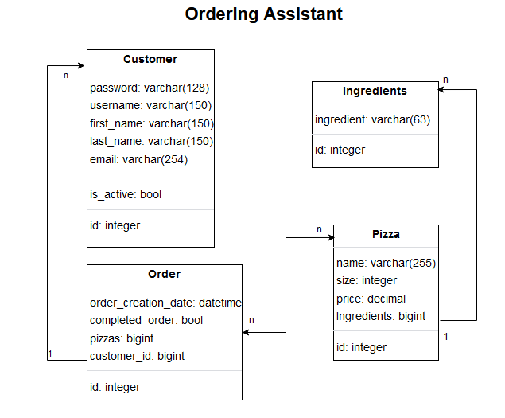
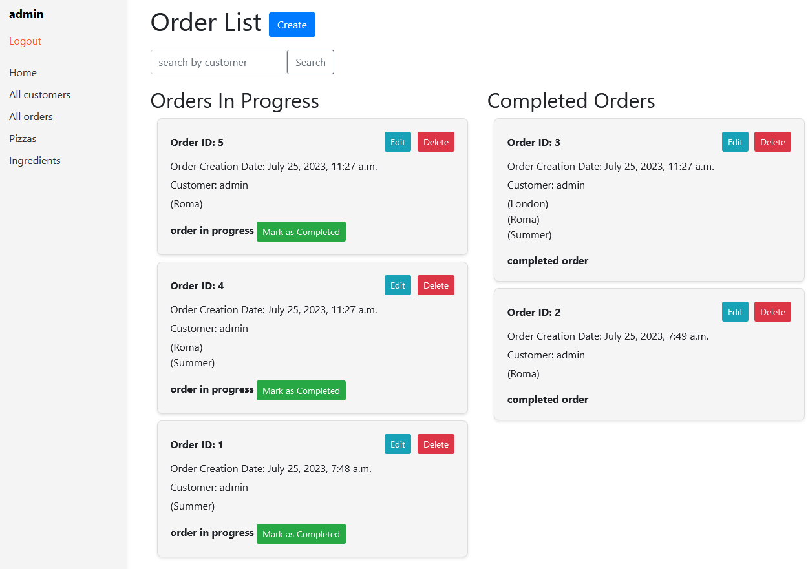
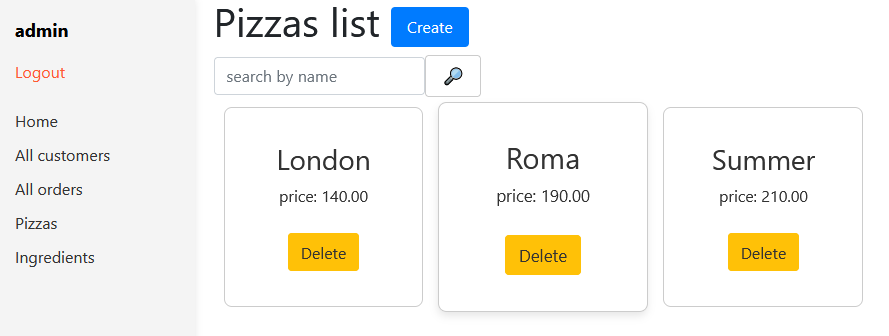
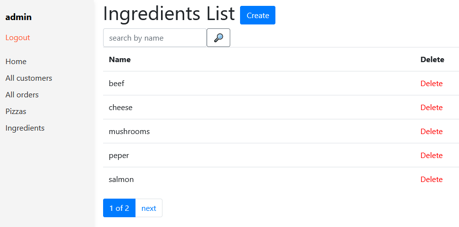
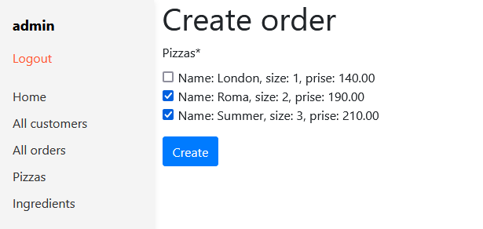

# Pizzeria ordering Assistant
## Link
[Table ordering](https://order-table-u5bq.onrender.com)
​
## Content:
​
- [Description](#description)
- [Application functional](#functional)
- [Future features](#functional)
- [Technologies](#technologies)
- [Prerequisites](#prerequisites)
- [Setup](#setup)
- [Usage](#usage)
- [Accessing the Application](#accessing-the-application)## Demo
- [Website Interface](#Demo)
​
## Description
​
My ever first, more or less big for me, pet project. It provides you opportunity to manage orders in small pizzeria.
​
## Application functional
* Install project
* Login/Register
* View, create, delete ingredients
* View, create, delete pizzas
* Manage orders
* Manage customers
​
## Future features
* add possibility online buying
* hide all unnecessary field from online customers
* customize pizza_detail.html
* remove edit bottom from completed orders
* rewrite front-end part of the project
​
## Technologies
​
- [Django Official Documentation](https://docs.djangoproject.com/)
Django is a high-level Python Web framework. In this project, it's used to create the whole website including frontend side. This service builds the Django application and exposes it on port 8000.
​
​
## Prerequisites
​
1. Make sure you have Python installed on your system. To check that you can run in your terminal ```python --version```
​
## Setup
​
1. Clone the project:
```
git clone https://github.com/Tarasidze/order-at-pizzeria
```
2. Install and activate virtual environment:
```
python -m venv venv
```
Then
```
# On Windows
venv\Scripts\activate

# On macOS or Linux
source venv/bin/activate
```
3. Install Django and requirements:
```
pip install -r requirements.txt
```
4. Create DataBase by running:
```
python manage.py migrate
```
5. Run server:
```
python manage.py runserver
```
​
## Shutdown
​
1. To stop running app in your terminal press:
```
ctrl + c
```
​
## Accessing the Application
​
* The Django application is accessible at `http://127.0.0.1:8000/`
* Create admin User ```python manage.py createsuperuser```
## Demo





